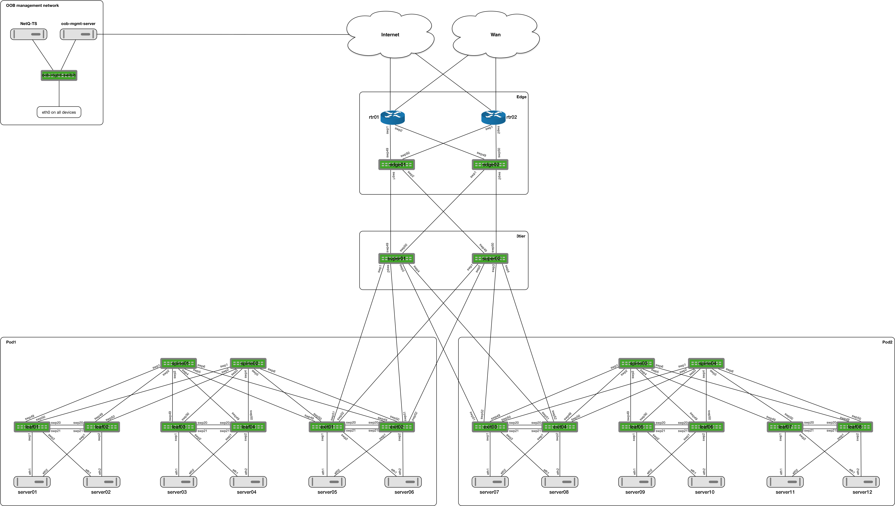
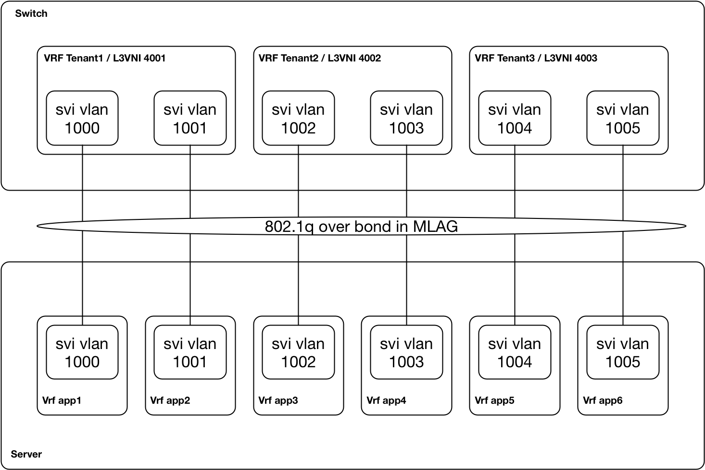
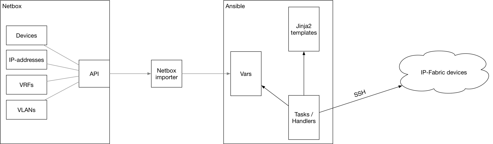
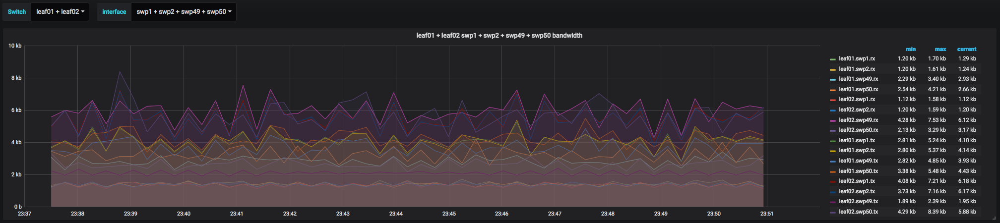
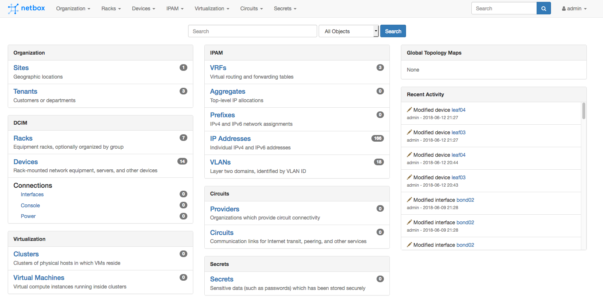
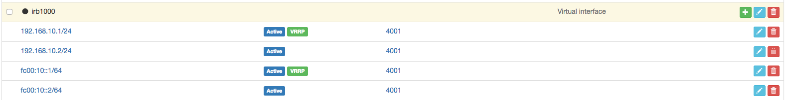

# Cumulus Putting It All Together demo

This demo will install Cumulus Linux (VX) in a 2-pod topology that was made with the [topology converter](https://github.com/CumulusNetworks/topology_converter). This demo puts several technologies together to demo a complete deployment:

* EVPN L2VNIs
* EVPN L3VNIs
  * IPv4 Type-5
  * IPv6 Type-5
* Cumulus NetQ
* VRF setup on Ubuntu 16.04 with Ifupdown2
* Netbox IPAM & automated provisioning of the Ansible inventory
* Grafana for graphs from the NetQ interface statistics
* CI/CD with Gitlab
* Custom Ansible Jinja templates to deploy the above





Table of Contents
=================
* [Prerequisites](#prerequisites)
* [Using Libvirt KVM](#using-libvirtkvm)
* [Using Virtualbox](#using-virtualbox)
* [Demo explanation](#demo-explanation)
  * [Tenant setup](#tenant-setup)
  * [Automation](#automation-and-orchestration)
* [Running the Demo](#running-the-demo)
  * [EVPN](#evpn)
  * [NetQ](#netq)
  * [Grafana](#grafana)
  * [Netbox](#netbox)
  * [CI/CD](#ci/cd)
* [Troubleshooting + FAQ](#troubleshooting--faq)


Prerequisites
------------------------
* Running this simulation roughly 23G of Ram (by default only pod1, superspines and edge are started. Full topology will use ~35G)
* Internet connectivity is required from the hypervisor. Multiple packages are installed on both the switches and servers when the lab is created.
* Download this repository locally with `git clone https://github.com/CumulusNetworks/cl-piat.git` 
* Download the NetQ Telemetry Server from https://cumulusnetworks.com/downloads/#product=NetQ%20Virtual&hypervisor=Vagrant. You need to be logged into the site to access this.  Choose NetQ 1.3.
* Setup your hypervisor according to the instructions with [Vagrant, Libvirt and KVM](https://docs.cumulusnetworks.com/display/VX/Vagrant+and+Libvirt+with+KVM+or+QEMU)

Using Libvirt+KVM
------------------------
* Install the Vagrant mutate plugin with 
`vagrant plugin install vagrant-mutate`
* Convert the existing NetQ telemetry server box image to a libvirt compatible version.   
`vagrant mutate cumulus-netq-telemetry-server-amd64-1.3.0-vagrant.box libvirt`
* Rename the new Vagrant box image by changing the Vagrant directory name.  
`mv $HOME/.vagrant.d/boxes/cumulus-netq-telemetry-server-amd64-1.3.0-vagrant/ $HOME/.vagrant.d/boxes/cumulus-VAGRANTSLASH-ts`
* Start the topology with the script `./evpn-symmetric-edge.sh`. This will run the vagrant commands to start the topology. By default only pod1, superspines and edge devices are started. This should provide sufficient devices for most demos, but the topology would give the possibility to run the demo on a larger environment. 

Next, when fully booted:
* Enter the environment by running `vagrant ssh oob-mgmt-server` from the vx-topology directory. On the oob-server, the same git repository is cloned that hold the necessary Ansible playbooks. Start provisioning the environment by running `./provision.sh` from the `cl-piat/automation` directory. This will run an ansible playbook that provisions the network devicees and servers. Running the full playbook when the topology isn't provisioned yet, can take several minutes, because several software packages have to be installed (be patient).

Using Virtualbox
------------------------
The topology can be generated for Virtualbox, but given the requirements it will not run on on typical desktops/laptops. Recommentation is to use the demo with the Libvirt/KVM. If Virtualbox is necessary, create an issue and we can create a Virtualbox Vagrantfile.  

Demo explanation
------------------------
This section explains how the demo has been built. The "running demo" section shows some examples that can be done during a live demo.

### Tenant setup
The environment is built with three tenants that are routed in the EVPN L3 overlay. Each leaf is provisioned with three VRFs/L3VNIs. Each VRFs has two IPv4 and IPv6 SVIs that could be different services on a host. These SVIs are tagged in 6 vlans to each server. The servers are setup with a new kernel, VRF support and VRF tools. This is done for two reasons, 1. Show the development of Linux tools by Cumulus and how it is applicable beyond just switches, 2. makeing sure that each "service" has it's own routing table and can be configured with a default route (statically for IPv4, through RAs with IPv6).



This setup means that there is no local bridging between the "apps" on the servers. E.g traffic from app1 to app2 on the same host will be routed on the TOR. There is no traffic possible between "apps" in different VRFs unless route-leaking would be configured on either rtr01/rtr02. 

### Automation and Orchestration

This environment is fully provisioned with Ansible in combination with Jinja2 templates. Currently the playbook is separated in multiple roles for each type of component, such as leaf and spine switches. The servers and provisioning of management tools is also done with separate roles. This creates an easy way of setting up the base for the demo / PoC environment.  



In most demos we have shown how orchestration of the configuration can be done through editting the Ansible variable files. While this might work in some environments, this wouldn't be always the case. In an environment with infrastructure data in multiple places, you would like to have a single source of truth. In this case Netbox (opensource IPAM, developed bij DigitalOcean) was used to store the variables needed to configure the infrastructure. In this demo the Netbox is the source of truth and orchestration is done as shown in the above diagram. The script "netbox.py" (Netbox importer), uses the Netbox api to generate a json file that contains the variable file for Ansible. Ansible uses the variables to generate the configuration files based on Jinja templates.

Running the Demo
------------------------
When the demo is fully provisioned, there are several topics that can be shown during the demo depending on the audience.

### EVPN
The spine / leaf topology has been deployed with a symmetrical EVPN setup with the aforementioned tenant setup. Log in to one of the leaf switches, for example leaf01:


This shows the routing table from one of the tenants with the EVPN /32 (and /128 for IPv6) host routes and the prefixes that are announced from the routers using EVPN Type-5:
```
cumulus@leaf01:mgmt-vrf:~$ net show route vrf tenant1

show ip route vrf tenant1 
==========================
Codes: K - kernel route, C - connected, S - static, R - RIP,
       O - OSPF, I - IS-IS, B - BGP, E - EIGRP, N - NHRP,
       T - Table, v - VNC, V - VNC-Direct, A - Babel, D - SHARP,
       F - PBR,
       > - selected route, * - FIB route


VRF tenant1:
B>* 10.201.1.0/24 [20/0] via 10.10.40.1, dummysvi404001 onlink, 3d09h06m
  *                      via 10.10.40.2, dummysvi404001 onlink, 3d09h06m
B>* 10.203.1.0/24 [20/0] via 10.10.40.1, dummysvi404001 onlink, 3d09h06m
  *                      via 10.10.40.2, dummysvi404001 onlink, 3d09h06m
C * 192.168.10.0/24 is directly connected, vlan1000-v0, 3d09h06m
C>* 192.168.10.0/24 is directly connected, vlan1000, 3d09h06m
B>* 192.168.10.13/32 [20/0] via 10.100.100.34, dummysvi404001 onlink, 3d00h36m
B>* 192.168.10.14/32 [20/0] via 10.100.100.34, dummysvi404001 onlink, 3d00h37m
B>* 192.168.10.15/32 [20/0] via 10.100.100.56, dummysvi404001 onlink, 3d08h49m
B>* 192.168.10.16/32 [20/0] via 10.100.100.56, dummysvi404001 onlink, 3d08h49m
C * 192.168.11.0/24 is directly connected, vlan1001-v0, 3d09h06m
C>* 192.168.11.0/24 is directly connected, vlan1001, 3d09h06m
B>* 192.168.11.13/32 [20/0] via 10.100.100.34, dummysvi404001 onlink, 3d00h36m
B>* 192.168.11.14/32 [20/0] via 10.100.100.34, dummysvi404001 onlink, 3d00h35m
B>* 192.168.11.15/32 [20/0] via 10.100.100.56, dummysvi404001 onlink, 3d08h49m
B>* 192.168.11.16/32 [20/0] via 10.100.100.56, dummysvi404001 onlink, 3d08h49m

show ipv6 route vrf tenant1 
============================
Codes: K - kernel route, C - connected, S - static, R - RIPng,
       O - OSPFv3, I - IS-IS, B - BGP, N - NHRP, T - Table,
       v - VNC, V - VNC-Direct, A - Babel, D - SHARP, F - PBR,
       > - selected route, * - FIB route

VRF tenant1:
C * fc00:10::/64 is directly connected, vlan1000-v0, 3d09h06m
C>* fc00:10::/64 is directly connected, vlan1000, 3d09h06m
B>* fc00:10::13/128 [20/0] via ::ffff:10.100.100.34, dummysvi404001 onlink, 3d00h30m
B>* fc00:10::14/128 [20/0] via ::ffff:10.100.100.34, dummysvi404001 onlink, 3d00h30m
B>* fc00:10::15/128 [20/0] via ::ffff:10.100.100.56, dummysvi404001 onlink, 3d08h48m
B>* fc00:10::16/128 [20/0] via ::ffff:10.100.100.56, dummysvi404001 onlink, 3d08h48m
C * fc00:11::/64 is directly connected, vlan1001-v0, 3d09h06m
C>* fc00:11::/64 is directly connected, vlan1001, 3d09h06m
B>* fc00:11::13/128 [20/0] via ::ffff:10.100.100.34, dummysvi404001 onlink, 3d00h30m
B>* fc00:11::14/128 [20/0] via ::ffff:10.100.100.34, dummysvi404001 onlink, 3d00h30m
B>* fc00:11::15/128 [20/0] via ::ffff:10.100.100.56, dummysvi404001 onlink, 3d08h48m
B>* fc00:11::16/128 [20/0] via ::ffff:10.100.100.56, dummysvi404001 onlink, 3d08h48m
B>* fc00:2701::/64 [20/0] via ::ffff:10.10.40.1, dummysvi404001 onlink, 3d09h06m
  *                       via ::ffff:10.10.40.2, dummysvi404001 onlink, 3d09h06m
B>* fc00:2703::/64 [20/0] via ::ffff:10.10.40.1, dummysvi404001 onlink, 3d09h06m
  *                       via ::ffff:10.10.40.2, dummysvi404001 onlink, 3d09h06m
```

Then log in to one of the servers to test connectivity:

```
cumulus@server01:~$ sudo ip vrf exec app1 ping6 fc00:2701::1 -c 3
PING fc00:2701::1(fc00:2701::1) 56 data bytes
64 bytes from fc00:2701::1: icmp_seq=1 ttl=62 time=2.70 ms
64 bytes from fc00:2701::1: icmp_seq=2 ttl=62 time=3.50 ms
64 bytes from fc00:2701::1: icmp_seq=3 ttl=62 time=2.79 ms

--- fc00:2701::1 ping statistics ---
3 packets transmitted, 3 received, 0% packet loss, time 2002ms
rtt min/avg/max/mdev = 2.706/3.004/3.509/0.361 ms
cumulus@server01:~$ sudo ip vrf exec app1 ping 10.201.1.1 -c 3
PING 10.201.1.1 (10.201.1.1) 56(84) bytes of data.
64 bytes from 10.201.1.1: icmp_seq=1 ttl=62 time=7.16 ms
64 bytes from 10.201.1.1: icmp_seq=2 ttl=62 time=7.66 ms
64 bytes from 10.201.1.1: icmp_seq=3 ttl=62 time=2.85 ms

--- 10.201.1.1 ping statistics ---
3 packets transmitted, 3 received, 0% packet loss, time 2003ms
rtt min/avg/max/mdev = 2.854/5.891/7.660/2.158 ms
```

During the demo, the generated configuration in `/etc/network/interfaces` and `/etc/frr/frr.conf` can be explained and shown how the Symmetrical EVPN setup has been made.

### NetQ
The NetQ Telemetry server has been deployed as a separate VM in the management network. The agent has been installed on all nodes, including the servers which allows to do demo the NetQ capabilities in this environment. Keep in mind that the topology is using Symmetrical EVPN. Not all functionalities around this feature have been implemented in NetQ and can cause issues.

A few examples:

```
cumulus@oob-mgmt-server:~/cl-piat/automation$ netq check mtu
Checked Nodes: 15, Checked Links: 395, Failed Nodes: 0, Failed Links: 0
No MTU Mismatch found

cumulus@oob-mgmt-server:~/cl-piat/automation$ netq check ntp
Total Nodes: 15, Checked Nodes: 15, Rotten Nodes: 0, Unknown Nodes: 0, failed NTP Nodes: 0

cumulus@oob-mgmt-server:~/cl-piat/automation$ netq check bgp
Total Nodes: 15, Failed Nodes: 0, Total Sessions: 62, Failed Sessions: 0
```

```
cumulus@oob-mgmt-server:~/cl-piat/automation$ netq trace 44:38:39:00:00:5a vlan 1000 from leaf04 vrf tenant1
leaf04 -- leaf04:vni101000 -- leaf04:swp50 -- spine02:swp1 -- leaf01:vni101000 -- leaf01:bond01 -- server01:eth1
                                           -- spine02:swp2 -- leaf02:vni101000 -- leaf02:bond01 -- server01:eth2
                           -- leaf04:swp49 -- spine01:swp1 -- leaf01:vni101000 -- leaf01:bond01 -- server01:eth1
                                           -- spine01:swp2 -- leaf02:vni101000 -- leaf02:bond01 -- server01:eth2
Path MTU is 9000
```

The traces can only be done if the source and destination are using the same L2VNI because of the Symmetrical routing.

```
cumulus@oob-mgmt-server:~/cl-piat/automation$ netq check clag
Checked Nodes: 6, Failed Nodes: 6 
Hostname          Error
----------------- --------------------------------------------------------------------------
exit01            MSTP not running on node                                                  
exit02            MSTP not running on node                                                  
leaf01            MSTP not running on node                                                  
leaf02            MSTP not running on node                                                  
leaf03            MSTP not running on node                                                  
leaf04            MSTP not running on node 
```

```
cumulus@oob-mgmt-server:~/cl-piat/automation$ netq edge01 show bgp

Matching bgp records:
Hostname          Neighbor                         VRF              ASN        Peer ASN   PfxRx        Last Changed
----------------- -------------------------------- ---------------- ---------- ---------- ------------ ----------------
edge01            swp1(super01)                    default          65401      65901      14/-/266     4d:22h:13m:9s
edge01            swp2(super02)                    default          65401      65902      14/-/266     4d:22h:13m:9s
edge01            vlan2500(rtr01)                  tenant1          65401      65501      1/2/-        4d:22h:13m:15s
edge01            vlan2501(rtr01)                  tenant2          65401      65501      1/1/-        4d:22h:13m:14s
edge01            vlan2503(rtr02)                  tenant1          65401      65502      1/2/-        4d:22h:13m:15s
edge01            vlan2504(rtr02)                  tenant2          65401      65502      1/1/-        4d:22h:13m:14s
```

### Grafana
During deployment Grafana is installed as a container on the netq-ts server. To make the gui accessable, we need to setup a remote ssh tunnel (from the NetQ-ts VM) to a host that is publicly accessible: `screen ssh -NR 3001:localhost:3000 <user>@<host>`. Exit the screen with ctcl+A,D after authentication. Unfortunately the current Ansible module for Grafana has a bug that prevents the dashboards to be automatically provisioned (https://github.com/ansible/ansible/issues/39663). When the interface is accessible (default user/pass: admin / CumulusLinux!), there are two dashboards available that can be imported into Grafana in the roles/telemetry/files directory. Import them both to have access to them.

The IP-fabric dashboard will display all interfaces on a specified switch:


The detailed dashboard allows for a more granular selection of interfaces on multiple switches. As shown in the screenshot it will show traffic / errors of the interfaces swp1,2,49,50 of switches leaf01 and leaf02. This allows for showing traffic from up / downlink for specific servers.


By default you will see only low traffic volumes. This repository also has an Ansible playbook that will use iperf to setup a full mesh of streams in all VRFs to show the traffic in the Grafana graphs. Use `ansible-playbook traffic.yaml -l servers` to start the traffic flows for 5 minutes.

### Netbox
Like Grafana, Netbox is also deployed as a container on the netq-ts server. To make the gui accessable, we need to setup a remote ssh tunnel (from the NetQ-ts VM) to a host that is publicly accessible: `screen ssh -NR 3002:localhost:32768 <user>@<host>`. Exit the screen with ctcl+A,D after authentication. When the interface is accessible (default user/pass: admin / CumulusLinux!) changes can be made to the configuration during a demo. These changes are imported to the Ansible variables and deployed to the infrastructure. These steps have to be done manually (although they can be automated) by running the `netbox.py` script and running the ansible-playbook, e.g `ansible-playbook deploy.yml -l network`.



During two changes would be good to see:

Change the status of one or more devices in the GUI and destroy/restart the devices so they have an emptry configuration `vagrant destroy leaf01;vagrant up leaf01`. Show that the device won't be provisioned until the status has been set to "Active" by running the `netbox.py` script and the Ansible playbook `ansible-playbook deploy.yml -l leaf01`.


We can also create an additional IRB interface on a device. Keep in mind that if it is intended to do on an mlag pair, it should be done on both.


### CI/CD
See the [CI/CD section](./demo/cicd) for more documentation on including CI/CD in this demo.

Troubleshooting + FAQ
-------
* The `Vagrantfile` expects the telemetry server to be named `cumulus/ts`. If you get the following error:

```
The box 'cumulus/ts' could not be found or could not be accessed in the remote catalog. If this is a private box on HashiCorp's Atlas, please verify you're logged in via `vagrant login`. Also, please double-check the name. The expanded URL and error message are shown below:

URL: ["https://atlas.hashicorp.com/cumulus/ts"]
Error: The requested URL returned error: 404 Not Found
```

Please ensure you have the telemetry server downloaded and installed in Vagrant. Use `vagrant box list` to see the current Vagrant box images you have installed.
* `vagrant ssh` fails to network devices - This is expected, as each network device connects through the `oob-mgmt-server`. Use `vagrant ssh oob-mgmt-server` then ssh to the specific network device.
* If you log into a switch and are prompted for the password for the `vagrant` user, issue the command `su - cumulus` to change to the cumulus user on the oob-mgmt-server
